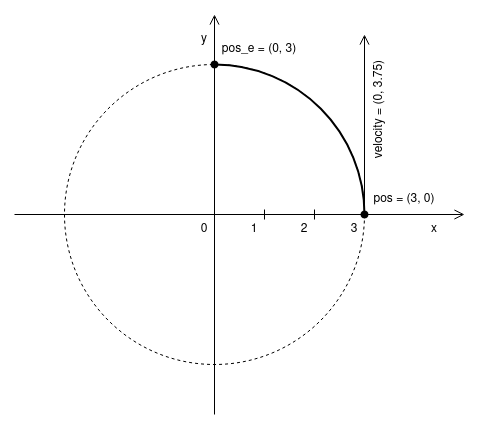

### test_path.cbot

test_predict_position_arc_p90_left

**Input**

* $L = 0.5$ `motor_left`
* $R = 1$ `motor_right`
* $\alpha = 90$ `angle between pos and pos_e`

**Output**

* t `time_delta`

**Solution**

$r = \cfrac{2}{1-\cfrac{L}{R}}-1 = 3$ `MOTOR_VALUE_TO_RADIUS_2`

$V = \frac{S}{t} \quad \text{Velocity definition}$

$L = \frac{\alpha \pi r}{180} \quad \text{Arc length}$

$V = 2.5(L + R) = 3.75$ `PREDICT_VELOCITY`

$t = \frac{\pi r}{5(L + R)} = \frac{2}{5} \pi \\approx 1.256637$

 |

